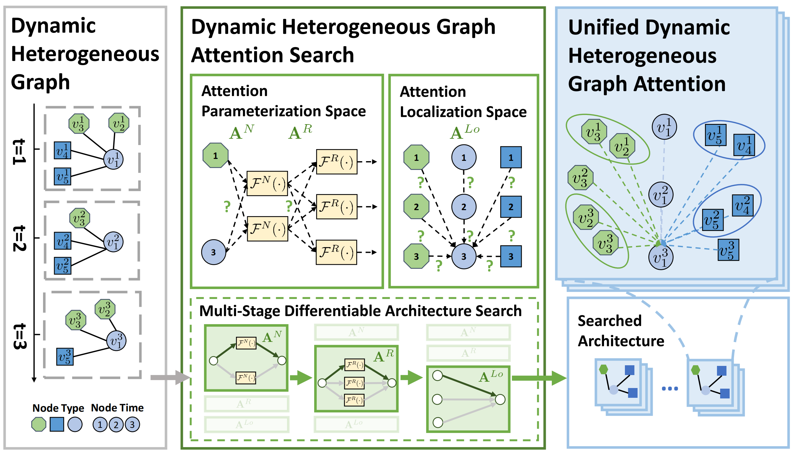

<h1 align="center">Dynamic Heterogeneous Graph Attention Neural Architecture Search (DHGAS)</h1>
<p align="center">
    <a href="https://github.com/wondergo2017/DHGAS"></a>
    <a href="https://ojs.aaai.org/index.php/AAAI/article/view/26338">  </a>
    <a href="./paper/AAAI23_Dynamic_Heterogeneous_Graph_Attention_Neural_Architecture_Search (Appendix).pdf"> </a>
    <a href="./paper/AAAI23 poster DHGAS.pdf"> </a>
</p>

This repository contains the code implementation of DHGAS as described in the paper: [Dynamic Heterogeneous Graph Attention Neural Architecture Search](https://ojs.aaai.org/index.php/AAAI/article/view/26338) (AAAI 2023).

## Introduction

Dynamic heterogeneous graph neural networks (DHGNNs) have been shown to be effective in handling the ubiquitous dynamic heterogeneous graphs. 

However, the existing DHGNNs are hand-designed, requiring extensive human efforts and failing to adapt to diverse dynamic heterogeneous graph scenarios. 

In this work, we propose a Dynamic Heterogeneous Graph Attention Search (DHGAS) method, aiming at automatically designing DHGNN architectures and adapting to various dynamic heterogeneous graph scenarios. In particular, we first propose a unified dynamic heterogeneous graph attention (DHGA) framework, which enables each node to jointly attend its heterogeneous and dynamic neighbors. Based on the framework, we design a localization space to determine where the attention should be applied and a parameterization space to determine how the attention should be parameterized. Lastly, we design a multi-stage differentiable search algorithm to efficiently explore the search space. The framework is shown in Figure 1.

<p align="center"></p>
<p align="center"><em>Figure 1.</em> The framework of DHGAS.</p>

## Installation
We have tested our codes with the following two requirements:  
- Python == 3.6
- Pytorch == 1.8.2+cu102
- Pytorch-Geometric == 2.0.3+cu102

Or 
- Python == 3.8
- Pytorch == 1.10.1+cu113
- Pytorch-Geometric == 2.0.3+cu113

Take the second requirement as an example. Please follow the following steps to create a virtual environment and install the required packages.

Clone the repository:
```
git clone git@github.com:wondergo2017/DHGAS.git
cd DHGAS
```

Create a virtual environment:
```
conda create --name dhgas python=3.8 -y
conda activate dhgas
```

Install dependencies:
```
conda install pytorch==1.10.1 cudatoolkit=11.3 -c pytorch -c conda-forge
pip install torch-scatter torch-sparse torch-geometric -f https://data.pyg.org/whl/torch-1.10.0+cu113.html
```

Install this repo as a library:
```
pip install -e .
```

## File Organization & Datasets

The files in this repo are organized as follows:

```
\data                       # put the datasets here
\dhgas                      
    \data                   # data utils including data loading, processing, etc. 
    \models                    
        \DHSpace.py         # our search space
        \DHSpaceSearch.py   # our search algoirthm
        ...                 # other baselines
    \trainer                # train/test utils for link prediction, node classification, etc.
    args_model.py           # parse model arguments 
    args_search.py          # parse nas arguments
    ...                     # other utils
\paper                      # main paper, appendix, poster, etc.
\logs                       
\scripts\run            
    run_model.py            # the script to run the model
    search_model.py         # the script to run the nas
```

The datasets can be downloaded from [google drive](https://drive.google.com/file/d/1CHqDq09U1ZKGMj4xpV8Ihl1ngA8NHq14/view?usp=sharing).

## Usage
An example to run the model or baselines is given as follows:
```
python scripts/run/run_model.py --dataset Ecomm --model RGCN --device 0
```
The repo includes ``Aminer, Ecomm, Yelp-nc``  datasets and  ``GCN, GAT, RGCN, HGT, DyHATR, HGT+, HTGNN`` models. 

An example to run the nas is given as follows:
```
python scripts/run/search_model.py --dataset Ecomm --device 0
```

An example to search architectures with limited budgets is given as follows:
```
python scripts/run/search_model.py --dataset Ecomm --device 0 --use_cfg 0 --KN X --KR X --KTO X --patch_num X --n_warmup X
```
where ``KN`` is the maximum number of node mapping functions, ``KR`` is the maximum number of relation mapping functions, ``KTO`` is the maximum number of attention connections per node type, ``patch_num`` is the number of patchs w.r.t time, ``n_warmup`` is the number of epochs to train the nas for each stage. More arguments can be found in [args_model.py](./dhgas/args_model.py) or [args_search.py](./dhgas/args_search.py).

An example to further develop to run other datasets or models is given as follows:

```python 
import torch
from dhgas.data import load_data
from dhgas.models import load_model
from dhgas.args_model import get_args
from dhgas.trainer import load_trainer

# args
args = get_args()

# load datasets. New datasets can be added in dhgas.data.load_data
dataset, args = load_data(args)

# load models. New models can be added in dhgas.models.load_model
model = load_model(args, dataset)

# Move to gpu device
model = model.to(args.device)
dataset.to(args.device)

# train. New trainers can be added in dhgas.trainer
trainer, criterion = load_trainer(args)
optimizer = torch.optim.Adam( params=model.parameters(), lr=args.lr , weight_decay=args.wd)
train_dict = trainer(model, optimizer, criterion, dataset, ...)
```

## Acknowledgements

The datasets and baseline scripts are modified from the publicly available repos or other resources. More details of the references, links, licences can be found in the [appendix](./paper/AAAI23_Dynamic_Heterogeneous_Graph_Attention_Neural_Architecture_Search%20(Appendix).pdf). We sincerely appreciate their contributions to the research community.

## Reference

If you find our paper and repo useful, please cite our paper:
```bibtex
@article{zhang2023dynamic,
  title     = {Dynamic Heterogeneous Graph Attention Neural Architecture Search},
  author    = {Zhang, Zeyang and Zhang, Ziwei and Wang, Xin and Qin, Yijian and Qin, Zhou and Zhu, Wenwu},
  journal   = {37th AAAI Conference on Artificial Intelligence},
  year={2023}
}
```